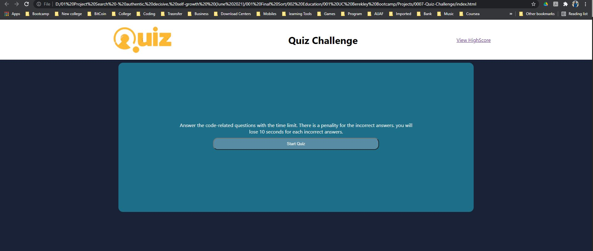

# Quiz-Challenge

## Description
This project is provide user to start a quiz challenge related to javascript questions, offers mulitiply questions. The program also has timer that will substract 10seconds on every incorrect answers. 

 

## Built-In 
    -   HTML 
    -   CSS
    -   JavaScript

## Author 
Mohammad Javid Moradi 

## GitHub Link and Website 
 -  https://github.com/moradi1412/0007-Quiz-Challenge
 -  https://moradi1412.github.io/0007-Quiz-Challenge/